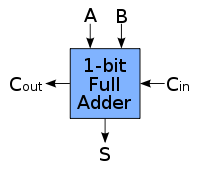

**Verilog**

Verilog is language commonly used in designing digital systems. It is a hardware description language, which means that it is substantially different from any other language you might have encountered so far. Even though it does have control flow statements and variables, it relies primarily on logic functions. It is a textual format for describing electronic circuits and systems.  

Verilog has evolved as a standard hardware description language. Verilog offers many useful features for hardware design. It is easy to learn and easy to use as it is similar to C Programming language. Designers with C Programming experience will find it easy to learn Verilog.  

**Adder**

This module explains how to build adder circuits using verilog. An **adder** or a **summer** is a digital circuit that performs addition of binary numbers. Adders are used not only in the arithmetic logic units, but also in other parts of the processor, to calculate addresses, table indices, etc. Adder is a simple circuit, but a fundamental one.

